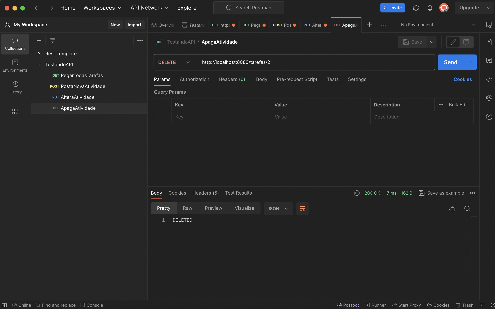

## API Cadastro de atividades

Esse é um exemplo de uma API (microserviço) para estudo tanto de programação quanto testes automatizados.

Ela foi criada para o estudo de testes de APIS com Postman, Java e SpringBoot

### Requisitos

Baixe e instale o [INTELIJ](https://www.jetbrains.com/idea/)

Baixe e instale a JDK mais recente [JDK](https://www.oracle.com/technetwork/java/javase/downloads/jdk8-downloads-2133151.html)

### Como rodar esse projeto

Clone ou baixe o projeto.

Navegue até a pasta com.company.nomeprojeto e abra a classe Application.java.

Um botão verde (um play) deve aparecer ao lado na linha 7, basta apertar ele.

A aplicação será iniciada e um servidor estará rodando e acessivel no endereço:

        localhost:8080/tarefas           

### A API

A API possui os endpoints:

    /tarefas --> GET atividades: para pegar todos as atividades.
    /tarefas/{ID}  --> GET atividade por ID: para pegar uma atividade com base no seu id.
    /tarefas       --> POST tarefas para cadastrar uma tarefa nova.
    /tarefas{ID}       --> PUT atualiza tarefa já cadastrada previamente.
    /tarefas/{ID}  --> DELETE tarefas por ID para deletar uma tarefa por ID.
    

Exemplo:

    http://localhost:8080/tarefas
        OU
    http://localhost:8080/tarefas/1
    deve te mostrar a lista de clientes cadastrados

Para cadastrar um cliente, vá no POSTMAN e crie um método POST.           
O corpo do método POST é um JSON e deve conter:

            {
              "id" : 1,
              "titulo" : "Criar atividade",
              "descricao" : "Criando tarefa teste na API em Java com spring boot"
            }

Exemplo Postman:

Conecte-se comigo

[Linkedin](http://linkedin.com/in/caiokenedy/)

